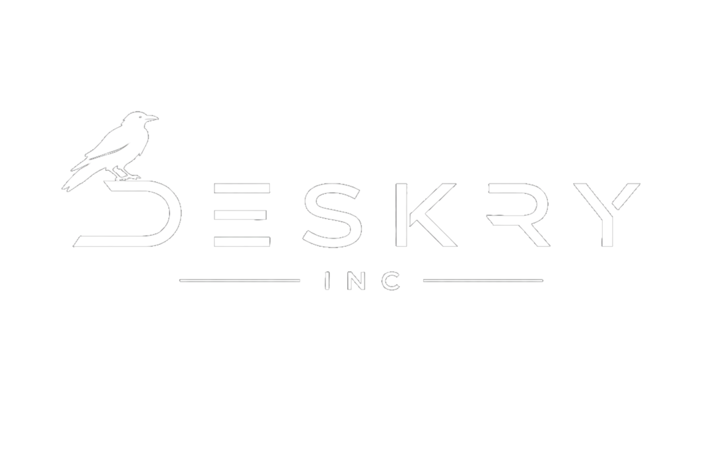

  
  
  #  Ali Mamedov
  ### 🎮 Game Developer |  🎨 Fullstack Developer
  
  *«Превращаю идеи в интерактивные миры»* 
  
  
  

---

## 🧭 Обо мне

Разрабатываю игры на Unity и создаю веб-платформы.

---

## 🛠 Стек технологий

  
  
  
  
  
  
  
  
  
  
  
  
  
  
  
  
  
  
  

---

## 🎮 Проекты

### 🔮 Morb — Mystic Orb: Dungeon Depths
*Roguelike-подземелье, где ты — магический орб*

[🔗 Посмотреть на GitHub](https://github.com/AboL1uS/morb-game)

Roguelike с процедурной генерацией подземелий. Unity (C#), NavMesh, система прогрессии заклинаний.

---

### 🗺️ Deskry — AI Career Navigator
*Персональный роадмап развития с помощью ИИ*

[🔗 Посмотреть на GitHub](https://github.com/AboL1uS/deskry)

Платформа для анализа навыков и построения роадмапов обучения. React 19, TypeScript, Gemini API, Tailwind CSS 4.

  

---

  ✨ Last updated: 2026

